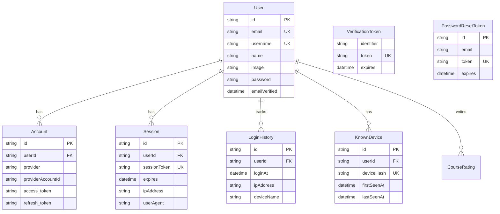

# Auth & User Schema

**Tables for authentication, user identity, and security.**

[← Back to Schema Overview](/docs/reference/database-schema)

---

## Overview

The auth and user domain contains tables for:
- **User identity**: Core user profile
- **OAuth providers**: External authentication connections
- **Sessions**: Active user sessions
- **Tokens**: Verification and password reset
- **Security**: Login history and device tracking

These tables implement Auth.js (NextAuth) with additional security features.

---

## Entity Relationship Diagram



---

## Table Definitions

### User

Core user identity and profile.

```prisma
model User {
  id            String   @id @default(cuid())
  name          String?
  email         String?  @unique
  emailVerified DateTime?
  image         String?
  password      String?
  username      String?  @unique
  bio           String?
  dateOfBirth   DateTime?
  country       String?
  createdAt     DateTime @default(now())
  updatedAt     DateTime @updatedAt

  // Relations
  accounts          Account[]
  sessions          Session[]
  courseMemberships CourseMembership[]
  groupMemberships  GroupMembership[]
  loginHistory      LoginHistory[]
  knownDevices      KnownDevice[]
  courseRatings     CourseRating[]
}
```

| Field | Type | Description |
|-------|------|-------------|
| `id` | String | Unique identifier (CUID) |
| `name` | String? | Display name |
| `email` | String? | Email address (unique) |
| `emailVerified` | DateTime? | When email was verified |
| `image` | String? | Profile picture URL |
| `password` | String? | Hashed password (for credentials auth) |
| `username` | String? | Unique username for profile URL |
| `bio` | String? | User biography |
| `dateOfBirth` | DateTime? | Date of birth |
| `country` | String? | Country of residence |

### Authentication Methods

| Method | `password` field | `Account` records |
|--------|------------------|-------------------|
| Email/Password | Hashed password | None |
| Google OAuth | `null` | Google provider account |
| Multiple | Both possible | Can have both |

---

### Account

OAuth provider connections (Auth.js standard).

```prisma
model Account {
  id                String  @id @default(cuid())
  userId            String
  type              String
  provider          String
  providerAccountId String
  refresh_token     String? @db.Text
  access_token      String? @db.Text
  expires_at        Int?
  token_type        String?
  scope             String?
  id_token          String? @db.Text
  session_state     String?

  user User @relation(fields: [userId], references: [id], onDelete: Cascade)

  @@unique([provider, providerAccountId])
  @@index([userId])
}
```

| Field | Type | Description |
|-------|------|-------------|
| `id` | String | Unique identifier (CUID) |
| `userId` | String | Foreign key to User |
| `type` | String | Account type (e.g., "oauth") |
| `provider` | String | Provider name (e.g., "google") |
| `providerAccountId` | String | User ID from the provider |
| `refresh_token` | String? | OAuth refresh token |
| `access_token` | String? | OAuth access token |
| `expires_at` | Int? | Token expiration timestamp |

---

### Session

Active user sessions (Auth.js standard with extensions).

```prisma
model Session {
  id           String   @id @default(cuid())
  sessionToken String   @unique
  userId       String
  expires      DateTime
  user         User     @relation(fields: [userId], references: [id], onDelete: Cascade)
  
  // Extended fields
  ipAddress    String?
  userAgent    String?
  deviceName   String?
  location     String?
  createdAt    DateTime @default(now())
  lastAccessed DateTime @default(now())

  @@index([userId])
  @@index([userId, lastAccessed])
}
```

| Field | Type | Description |
|-------|------|-------------|
| `id` | String | Unique identifier (CUID) |
| `sessionToken` | String | Unique session token |
| `userId` | String | Foreign key to User |
| `expires` | DateTime | Session expiration time |
| `ipAddress` | String? | IP address of session creation |
| `userAgent` | String? | Browser/client user agent |
| `deviceName` | String? | Friendly device name |
| `location` | String? | Geographic location |
| `lastAccessed` | DateTime | Last activity timestamp |

### Session Management Features

- **Multiple sessions**: Users can have multiple active sessions
- **Session tracking**: Extended fields track device info
- **Activity monitoring**: `lastAccessed` tracks recent activity
- **Session revocation**: Can delete individual sessions

---

### VerificationToken

Email verification tokens (Auth.js standard).

```prisma
model VerificationToken {
  identifier String
  token      String   @unique
  expires    DateTime

  @@unique([identifier, token])
}
```

| Field | Type | Description |
|-------|------|-------------|
| `identifier` | String | Email address being verified |
| `token` | String | Unique verification token |
| `expires` | DateTime | Token expiration time |

---

### PasswordResetToken

Password reset flow tokens.

```prisma
model PasswordResetToken {
  id        String   @id @default(cuid())
  email     String
  token     String   @unique
  expires   DateTime
  createdAt DateTime @default(now())

  @@unique([email, token])
}
```

| Field | Type | Description |
|-------|------|-------------|
| `id` | String | Unique identifier (CUID) |
| `email` | String | Email address for reset |
| `token` | String | Unique reset token |
| `expires` | DateTime | Token expiration time |

---

### LoginHistory

Audit trail of user logins.

```prisma
model LoginHistory {
  id         String   @id @default(cuid())
  userId     String
  user       User     @relation(fields: [userId], references: [id], onDelete: Cascade)
  ipAddress  String?
  userAgent  String?
  deviceName String?
  location   String?
  loginAt    DateTime @default(now())
  sessionId  String?

  @@index([userId, loginAt])
}
```

| Field | Type | Description |
|-------|------|-------------|
| `id` | String | Unique identifier (CUID) |
| `userId` | String | Foreign key to User |
| `ipAddress` | String? | Login IP address |
| `userAgent` | String? | Browser/client user agent |
| `deviceName` | String? | Friendly device name |
| `location` | String? | Geographic location |
| `loginAt` | DateTime | Login timestamp |
| `sessionId` | String? | Associated session ID |

### Use Cases

- **Security monitoring**: Detect unusual login patterns
- **Account activity**: Show user their login history
- **Compliance**: Audit trail for security reviews

---

### KnownDevice

Recognized user devices for security.

```prisma
model KnownDevice {
  id          String   @id @default(cuid())
  userId      String
  user        User     @relation(fields: [userId], references: [id], onDelete: Cascade)
  deviceHash  String
  firstSeenAt DateTime @default(now())
  lastSeenAt  DateTime @default(now())

  @@unique([userId, deviceHash])
  @@index([userId])
}
```

| Field | Type | Description |
|-------|------|-------------|
| `id` | String | Unique identifier (CUID) |
| `userId` | String | Foreign key to User |
| `deviceHash` | String | Hash of device fingerprint |
| `firstSeenAt` | DateTime | First time device was seen |
| `lastSeenAt` | DateTime | Most recent device activity |

### Device Recognition

Device hash is computed from:
- User agent
- Screen resolution
- Timezone
- Other browser fingerprint data

### Use Cases

- **New device alerts**: Notify users of logins from new devices
- **Security**: Flag suspicious device changes
- **Session management**: Show users their known devices

---

## Security Features

### Password Handling

- Passwords are hashed with bcrypt before storage
- Never stored or logged in plaintext
- Separate from OAuth (users can have both)

### Token Lifecycle

| Token Type | Default Expiry | Purpose |
|------------|----------------|---------|
| Session | 30 days | Keep user logged in |
| Verification | 24 hours | Email verification |
| Password Reset | 1 hour | Password reset flow |

### Session Security

- Sessions can be individually revoked
- Extended device tracking for security
- IP and location logging for audit

---

## Auth.js Integration

These tables follow Auth.js conventions:

| Table | Auth.js | Extensions |
|-------|---------|------------|
| `User` | Standard | `username`, `bio`, `dateOfBirth`, `country` |
| `Account` | Standard | None |
| `Session` | Standard | `ipAddress`, `userAgent`, `deviceName`, `location`, `lastAccessed` |
| `VerificationToken` | Standard | None |

Additional tables (`PasswordResetToken`, `LoginHistory`, `KnownDevice`) are custom extensions.

---

## Related Documentation

- [Auth.js Documentation](https://authjs.dev/)
- [User Model Specification](/docs/features/specifications/user-model)

---

[← Back to Schema Overview](/docs/reference/database-schema)


