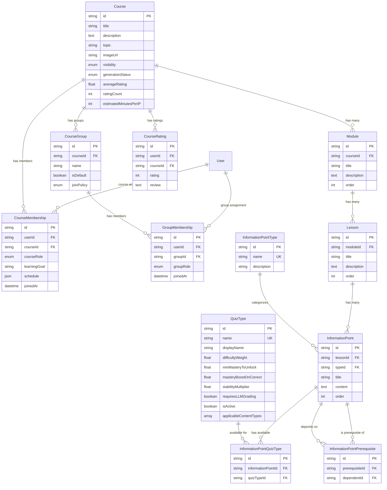

# Course Structure Schema

**Tables for content hierarchy, course access, and organization.**

[← Back to Schema Overview](/docs/reference/database-schema)

---

## Overview

The course structure domain contains tables for:
- **Content hierarchy**: Course → Module → Lesson → Information Point
- **Course access**: Memberships and roles
- **Course ratings**: User ratings and reviews
- **Groups**: Cohorts within courses
- **Lookup tables**: Content types and quiz formats
- **Junction tables**: Prerequisites and quiz type assignments

---

## Entity Relationship Diagram



---

## Content Hierarchy

The learning content is organized hierarchically:

```
Course → Module → Lesson → Information Point
```

Each level contains the next, with ordering preserved at each level.

---

## Table Definitions

### Course

The top-level container for learning content. A complete learning pathway for a topic.

```prisma
model Course {
  id               String                 @id @default(cuid())
  title            String
  description      String?                @db.Text
  topic            String?
  imageUrl         String?
  visibility       CourseVisibility       @default(PRIVATE)
  generationStatus CourseGenerationStatus @default(PENDING)
  
  // Rating & time estimates (denormalized for performance)
  averageRating         Float?  // 0-5 scale, null if no ratings
  ratingCount           Int     @default(0)
  estimatedMinutesPerIP Int     @default(30) // For time estimates
  
  createdAt        DateTime               @default(now())
  updatedAt        DateTime               @updatedAt
}

enum CourseVisibility {
  PRIVATE   // Only members can see
  PUBLIC    // Anyone can discover and join
}

enum CourseGenerationStatus {
  PENDING     // Course creation initiated, not yet generating
  GENERATING  // AI is generating content
  COMPLETED   // Generation finished successfully
  FAILED      // Generation encountered an error
}
```

| Field | Type | Description |
|-------|------|-------------|
| `id` | String | Unique identifier (CUID) |
| `title` | String | Course name |
| `description` | String? | What the course covers |
| `topic` | String? | Subject area for categorization |
| `imageUrl` | String? | Cover image URL |
| `visibility` | CourseVisibility | Who can see/join the course |
| `generationStatus` | CourseGenerationStatus | AI content generation state |
| `averageRating` | Float? | Denormalized average rating (0-5 scale), null if no ratings |
| `ratingCount` | Int | Denormalized count of ratings |
| `estimatedMinutesPerIP` | Int | Estimated minutes to master each Information Point (default: 30) |

**Time Estimates:**

The `estimatedMinutesPerIP` field is used to calculate time-to-mastery estimates:
- Default is 30 minutes per Information Point
- Total hours = `totalIPs * estimatedMinutesPerIP / 60`
- Weeks to mastery = `totalHours / hoursPerWeek` (assumes 5 hrs/week by default)

**Relationships:**
- Members are managed via `CourseMembership` table
- Groups/cohorts are managed via `CourseGroup` table
- Ratings are stored in `CourseRating` table (individual) with denormalized aggregates on Course

---

### CourseRating

Stores individual user ratings for courses. The Course model maintains denormalized `averageRating` and `ratingCount` fields for efficient queries.

```prisma
model CourseRating {
  id        String   @id @default(cuid())
  userId    String
  courseId  String
  rating    Int      // 1-5 scale
  review    String?  @db.Text // Optional written review
  
  createdAt DateTime @default(now())
  updatedAt DateTime @updatedAt

  @@unique([userId, courseId]) // One rating per user per course
  @@index([courseId])
  @@index([userId])
}
```

| Field | Type | Description |
|-------|------|-------------|
| `id` | String | Unique identifier (CUID) |
| `userId` | String | Foreign key to User |
| `courseId` | String | Foreign key to Course |
| `rating` | Int | Rating value (1-5 scale) |
| `review` | String? | Optional written review |
| `createdAt` | DateTime | When the rating was created |
| `updatedAt` | DateTime | When the rating was last updated |

**Average Update Formulas:**

When a rating is created, updated, or deleted, the Course's `averageRating` and `ratingCount` must be updated:

```typescript
// On new rating:
newAverage = ((oldAverage * oldCount) + newRating) / (oldCount + 1)

// On update:
newAverage = ((oldAverage * oldCount) - oldRating + newRating) / oldCount

// On delete:
newAverage = oldCount > 1 
  ? ((oldAverage * oldCount) - deletedRating) / (oldCount - 1) 
  : null
```

---

### CourseGroup

A cohort or group within a course. Each course has a default group, with optional sub-groups.

```prisma
model CourseGroup {
  id         String          @id @default(cuid())
  courseId   String
  name       String
  isDefault  Boolean         @default(false)
  joinPolicy GroupJoinPolicy @default(INVITE_ONLY)
  
  createdAt  DateTime        @default(now())
  updatedAt  DateTime        @updatedAt

  @@index([courseId])
}

enum GroupJoinPolicy {
  OPEN           // Anyone in the course can join this group
  MEMBER_INVITE  // Any group member can invite others
  LEADER_ONLY    // Only group leaders can invite
  INVITE_ONLY    // Only course admins/creators can add members
}
```

| Field | Type | Description |
|-------|------|-------------|
| `id` | String | Unique identifier (CUID) |
| `courseId` | String | Foreign key to Course |
| `name` | String | Group name (e.g., "Spring 2025 Cohort") |
| `isDefault` | Boolean | Whether this is the default group for the course |
| `joinPolicy` | GroupJoinPolicy | Who can add members to this group |

**Join Policy Examples:**

| Policy | Who Can Add Members | Use Case |
|--------|---------------------|----------|
| `OPEN` | Self-join (any course member) | Study groups, optional cohorts |
| `MEMBER_INVITE` | Any existing group member | Peer-driven groups |
| `LEADER_ONLY` | Group leaders only | Classroom groups |
| `INVITE_ONLY` | Course admins/creators only | Controlled enrollment |

---

### CourseMembership

Links users to courses with a course-level role. Determines access and permissions. Also stores user-specific learning preferences for this course.

```prisma
model CourseMembership {
  id           String     @id @default(cuid())
  userId       String
  courseId     String
  courseRole   CourseRole
  
  // User-specific learning data
  learningGoal String?    @db.Text  // User's objective for this course
  schedule     Json?      // { daysPerWeek: string[], minutesPerSession: number }
  
  joinedAt     DateTime   @default(now())

  @@unique([userId, courseId])
  @@index([userId])
  @@index([courseId])
}

enum CourseRole {
  CREATOR   // Full control, can delete course
  ADMIN     // Can manage members, edit content
  STUDENT   // Can learn, take quizzes
}
```

| Field | Type | Description |
|-------|------|-------------|
| `id` | String | Unique identifier (CUID) |
| `userId` | String | Foreign key to User |
| `courseId` | String | Foreign key to Course |
| `courseRole` | CourseRole | User's role in the course |
| `learningGoal` | String? | User's personal objective for taking this course |
| `schedule` | Json? | User's study schedule (days per week, minutes per session) |
| `joinedAt` | DateTime | When the user joined |

**Schedule JSON Structure:**

```typescript
interface Schedule {
  daysPerWeek: ('monday' | 'tuesday' | 'wednesday' | 'thursday' | 'friday' | 'saturday' | 'sunday')[];
  minutesPerSession: number; // 5-120
}
```

---

### GroupMembership

Links users to groups within a course. A user can only be in one group per course.

```prisma
model GroupMembership {
  id        String    @id @default(cuid())
  userId    String
  groupId   String
  groupRole GroupRole
  
  joinedAt  DateTime  @default(now())

  @@unique([userId, groupId])
  @@index([userId])
  @@index([groupId])
}

enum GroupRole {
  LEADER    // Can view group progress, lead discussions
  MEMBER    // Regular group member
}
```

| Field | Type | Description |
|-------|------|-------------|
| `id` | String | Unique identifier (CUID) |
| `userId` | String | Foreign key to User |
| `groupId` | String | Foreign key to CourseGroup |
| `groupRole` | GroupRole | User's role in the group |
| `joinedAt` | DateTime | When the user joined the group |

**Example membership scenarios:**

| User | Course Role | Group | Group Role |
|------|-------------|-------|------------|
| Alice | CREATOR | - | - |
| Bob | ADMIN | Cohort A | LEADER |
| Carol | STUDENT | Cohort A | MEMBER |
| Dave | STUDENT | Cohort B | LEADER |

---

### Module

A major thematic section of a course containing multiple lessons.

```prisma
model Module {
  id          String   @id @default(cuid())
  courseId    String
  title       String
  description String?  @db.Text
  order       Int
  
  createdAt   DateTime @default(now())
  updatedAt   DateTime @updatedAt

  @@unique([courseId, order])
  @@index([courseId])
}
```

| Field | Type | Description |
|-------|------|-------------|
| `id` | String | Unique identifier (CUID) |
| `courseId` | String | Foreign key to Course |
| `title` | String | Module title |
| `description` | String? | Optional description |
| `order` | Int | Position within course (unique per course) |

---

### Lesson

A single study session containing multiple Information Points.

```prisma
model Lesson {
  id          String   @id @default(cuid())
  moduleId    String
  title       String
  description String?  @db.Text
  order       Int
  
  createdAt   DateTime @default(now())
  updatedAt   DateTime @updatedAt

  @@unique([moduleId, order])
  @@index([moduleId])
}
```

| Field | Type | Description |
|-------|------|-------------|
| `id` | String | Unique identifier (CUID) |
| `moduleId` | String | Foreign key to Module |
| `title` | String | Lesson title |
| `description` | String? | Optional description |
| `order` | Int | Position within module (unique per module) |

---

### InformationPoint

The atomic unit of learning—a single, testable concept.

```prisma
model InformationPoint {
  id        String   @id @default(cuid())
  lessonId  String
  typeId    String?
  title     String
  content   String   @db.Text
  order     Int
  
  createdAt DateTime @default(now())
  updatedAt DateTime @updatedAt

  @@unique([lessonId, order])
  @@index([lessonId])
  @@index([typeId])
}
```

| Field | Type | Description |
|-------|------|-------------|
| `id` | String | Unique identifier (CUID) |
| `lessonId` | String | Foreign key to Lesson |
| `typeId` | String? | Optional foreign key to InformationPointType |
| `title` | String | Clear, concise name for the concept |
| `content` | String | Markdown content explaining the concept |
| `order` | Int | Position within lesson (unique per lesson) |

**Relationships:**
- Prerequisites are stored in `InformationPointPrerequisite` table
- Available quiz types are stored in `InformationPointQuizType` table

---

## Lookup Tables

### InformationPointType

Categorizes Information Points by their pedagogical purpose. Used primarily by AI for content generation and quiz selection.

```prisma
model InformationPointType {
  id          String   @id @default(cuid())
  name        String   @unique
  description String?
  
  createdAt   DateTime @default(now())
  updatedAt   DateTime @updatedAt
}
```

| Field | Type | Description |
|-------|------|-------------|
| `id` | String | Unique identifier (CUID) |
| `name` | String | Unique type name (e.g., "definition") |
| `description` | String? | Human-readable description |

---

### QuizType

Defines quiz formats and their impact on the mastery algorithm. See [Learning & Review](/docs/reference/database-schema/learning-review) for how these are used.

```prisma
model QuizType {
  id                     String   @id @default(cuid())
  name                   String   @unique
  displayName            String
  description            String?
  difficultyWeight       Float
  minMasteryToUnlock     Float
  masteryBoostOnCorrect  Float
  stabilityMultiplier    Float
  applicableContentTypes String[] // e.g., ['text', 'code', 'math']
  requiresLLMGrading     Boolean  @default(false)
  isActive               Boolean  @default(true)
  
  createdAt              DateTime @default(now())
  updatedAt              DateTime @updatedAt
}
```

| Field | Type | Description |
|-------|------|-------------|
| `id` | String | Unique identifier (CUID) |
| `name` | String | Unique type name (e.g., "binary") |
| `displayName` | String | User-facing name (e.g., "True/False") |
| `description` | String? | Optional description |
| `difficultyWeight` | Float | Relative difficulty (1.0 = baseline) |
| `minMasteryToUnlock` | Float | Mastery level required to unlock (0-1) |
| `masteryBoostOnCorrect` | Float | Added to mastery on correct answer |
| `stabilityMultiplier` | Float | Multiplier for stability increase |
| `applicableContentTypes` | String[] | Content types this quiz format works with |
| `requiresLLMGrading` | Boolean | Whether AI grading is needed |
| `isActive` | Boolean | Whether this type is currently available |

**Content Types:**
- `text` — Standard text-based content
- `code` — Programming code snippets
- `math` — Mathematical formulas and equations

---

## Junction Tables

### InformationPointQuizType

Links Information Points to their available quiz types.

```prisma
model InformationPointQuizType {
  id                 String @id @default(cuid())
  informationPointId String
  quizTypeId         String

  @@unique([informationPointId, quizTypeId])
  @@index([informationPointId])
  @@index([quizTypeId])
}
```

| Field | Type | Description |
|-------|------|-------------|
| `id` | String | Unique identifier (CUID) |
| `informationPointId` | String | Foreign key to InformationPoint |
| `quizTypeId` | String | Foreign key to QuizType |

---

### InformationPointPrerequisite

Defines directed prerequisite relationships between Information Points.

```prisma
model InformationPointPrerequisite {
  id             String   @id @default(cuid())
  prerequisiteId String
  dependentId    String
  
  createdAt      DateTime @default(now())

  @@unique([prerequisiteId, dependentId])
  @@index([prerequisiteId])
  @@index([dependentId])
}
```

| Field | Type | Description |
|-------|------|-------------|
| `id` | String | Unique identifier (CUID) |
| `prerequisiteId` | String | The IP that must be learned first |
| `dependentId` | String | The IP that requires the prerequisite |

**Example:** If understanding "Words" requires knowing "Letters", then:
- `prerequisiteId` = ID of "Letters" IP
- `dependentId` = ID of "Words" IP

---

## Seed Data

### Default InformationPointType Values

| name | description |
|------|-------------|
| `definition` | What something means |
| `concept` | How something works or relates |
| `procedure` | Steps to accomplish something |
| `example` | Concrete instance of a concept |

### Default QuizType Values

| name | displayName | difficultyWeight | minMasteryToUnlock | masteryBoostOnCorrect | stabilityMultiplier | applicableContentTypes | requiresLLMGrading |
|------|-------------|------------------|--------------------|-----------------------|---------------------|------------------------|-------------------|
| `binary` | True/False | 0.5 | 0.0 | 0.05 | 1.0 | text, code, math | false |
| `multiple_choice` | Multiple Choice | 1.0 | 0.15 | 0.10 | 1.5 | text, code, math | false |
| `question_answer` | Q&A | 2.0 | 0.40 | 0.15 | 2.0 | text, code | true |

---

[← Back to Schema Overview](/docs/reference/database-schema)


