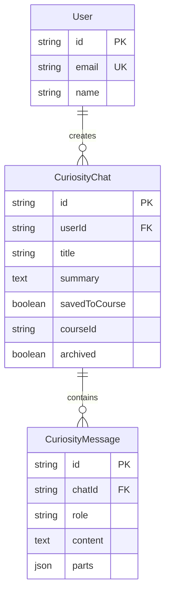

# Curiosity Chat Schema

**Tables for free-form exploration and conversation.**

[← Back to Schema Overview](/docs/reference/database-schema)

---

## Overview

The curiosity chat domain contains tables for:
- **CuriosityChat**: A conversation thread for exploration
- **CuriosityMessage**: Individual messages within a chat

These tables support the Explore feature, allowing users to have free-form conversations outside the structured course learning path.

---

## Entity Relationship Diagram



---

## Table Definitions

### CuriosityChat

A conversation thread for free-form exploration.

```prisma
model CuriosityChat {
  id            String             @id @default(cuid())
  userId        String
  title         String
  summary       String?            @db.Text // AI-generated summary
  savedToCourse Boolean            @default(false)
  courseId      String?
  archived      Boolean            @default(false) // Soft delete
  createdAt     DateTime           @default(now())
  updatedAt     DateTime           @updatedAt

  // Relations
  messages CuriosityMessage[]

  @@index([userId])
  @@index([userId, updatedAt])
  @@index([userId, archived])
}
```

| Field | Type | Description |
|-------|------|-------------|
| `id` | String | Unique identifier (CUID) |
| `userId` | String | Foreign key to User |
| `title` | String | Chat title (can be AI-generated) |
| `summary` | String? | AI-generated summary of the conversation |
| `savedToCourse` | Boolean | Whether content was saved to a course |
| `courseId` | String? | Course ID if in-course exploration |
| `archived` | Boolean | Soft delete flag |

### Indexes

| Index | Purpose |
|-------|---------|
| `[userId]` | Find all chats for a user |
| `[userId, updatedAt]` | Sorted listing by most recent |
| `[userId, archived]` | Filter active vs archived chats |

---

### CuriosityMessage

An individual message in a curiosity chat.

```prisma
model CuriosityMessage {
  id        String   @id @default(cuid())
  chatId    String
  role      String   // 'user' or 'assistant'
  content   String   @db.Text
  parts     Json?    // AI SDK v6 parts array (tool calls, etc.)
  createdAt DateTime @default(now())

  // Relations
  chat CuriosityChat @relation(fields: [chatId], references: [id], onDelete: Cascade)

  @@index([chatId])
  @@index([chatId, createdAt])
}
```

| Field | Type | Description |
|-------|------|-------------|
| `id` | String | Unique identifier (CUID) |
| `chatId` | String | Foreign key to CuriosityChat |
| `role` | String | Message sender: 'user' or 'assistant' |
| `content` | String | Message text content |
| `parts` | Json? | AI SDK v6 parts array (tool calls, rich content) |

### Parts JSON Structure

The `parts` field stores AI SDK v6 message parts for rich interactions:

```typescript
type MessagePart =
  | { type: 'text'; text: string }
  | { type: 'tool-call'; toolCallId: string; toolName: string; args: object }
  | { type: 'tool-result'; toolCallId: string; result: unknown };

// Example
const parts = [
  { type: 'text', text: 'Let me search for that...' },
  { type: 'tool-call', toolCallId: 'call_123', toolName: 'web_search', args: { query: 'quantum computing' } },
  { type: 'tool-result', toolCallId: 'call_123', result: { ... } }
];
```

---

## Usage Patterns

### Creating a New Chat

```typescript
const chat = await prisma.curiosityChat.create({
  data: {
    userId: user.id,
    title: 'Exploring Quantum Computing',
    courseId: null, // General exploration
  },
});
```

### In-Course Exploration

```typescript
const chat = await prisma.curiosityChat.create({
  data: {
    userId: user.id,
    title: 'Questions about Binary Trees',
    courseId: 'course_123', // Linked to a specific course
  },
});
```

### Adding Messages

```typescript
await prisma.curiosityMessage.create({
  data: {
    chatId: chat.id,
    role: 'user',
    content: 'What is quantum entanglement?',
  },
});

await prisma.curiosityMessage.create({
  data: {
    chatId: chat.id,
    role: 'assistant',
    content: 'Quantum entanglement is a phenomenon...',
    parts: [
      { type: 'text', text: 'Quantum entanglement is a phenomenon...' }
    ],
  },
});
```

### Listing Chats (Most Recent First)

```typescript
const chats = await prisma.curiosityChat.findMany({
  where: {
    userId: user.id,
    archived: false,
  },
  orderBy: {
    updatedAt: 'desc',
  },
  take: 20,
});
```

### Loading Chat with Messages

```typescript
const chat = await prisma.curiosityChat.findUnique({
  where: { id: chatId },
  include: {
    messages: {
      orderBy: { createdAt: 'asc' },
    },
  },
});
```

### Archiving a Chat

```typescript
await prisma.curiosityChat.update({
  where: { id: chatId },
  data: { archived: true },
});
```

---

## Save Discovery Flow

When a user discovers something valuable in a curiosity chat, they can save it to a course:

```typescript
// 1. Update chat as saved
await prisma.curiosityChat.update({
  where: { id: chatId },
  data: {
    savedToCourse: true,
    courseId: targetCourseId,
  },
});

// 2. Create new InformationPoint from discovery
await prisma.informationPoint.create({
  data: {
    lessonId: targetLessonId,
    title: 'Discovered: Quantum Entanglement',
    content: extractedContent,
    order: nextOrder,
  },
});
```

---

## Contexts

| Context | `courseId` | Description |
|---------|------------|-------------|
| **General** | `null` | Free exploration, any topic |
| **In-Course** | Course ID | Exploration related to a specific course |

### In-Course Context

When a chat has a `courseId`:
- AI has access to course content for context
- Discoveries can be easily saved to that course
- Chat appears in the course's exploration history

---

## Related Features

- **Explore Mode**: Free-form exploration feature
- [Learning & Interaction Modes](/docs/features/specifications/learning-interaction-modes) — Mode specifications

---

[← Back to Schema Overview](/docs/reference/database-schema)


