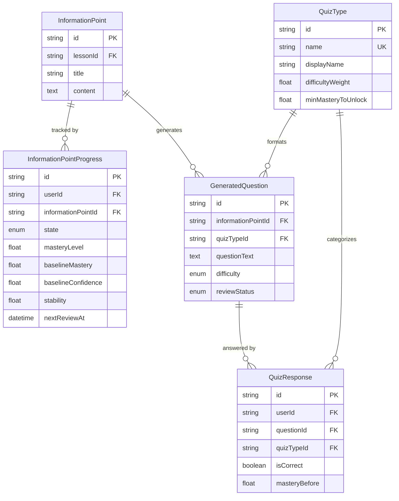

# Learning & Review Schema

**Tables for progress tracking, mastery, and quiz system.**

[← Back to Schema Overview](/docs/reference/database-schema)

---

## Overview

The learning and review domain contains tables for:
- **Progress tracking**: User mastery per information point
- **Question generation**: AI-generated quiz questions
- **Quiz responses**: User answers and state snapshots

These tables power the spaced repetition algorithm and adaptive quiz system.

---

## Entity Relationship Diagram



---

## Table Definitions

### InformationPointProgress

Tracks a user's relationship with a single information point using a dual-track mastery system.

```prisma
model InformationPointProgress {
  id                 String        @id @default(cuid())
  userId             String
  informationPointId String
  state              ProgressState @default(UNSEEN)

  // Dual-track mastery
  masteryLevel       Float    @default(0) // Current understanding (0-1), volatile
  baselineMastery    Float    @default(0) // Long-term average (0-1), stable
  baselineConfidence Float    @default(0) // Reliability of baseline (0-1)
  stability          Float    @default(1) // Days until ~90% forgetting probability
  nextReviewAt       DateTime?            // When system will next present this IP

  // Performance stats
  totalAttempts   Int @default(0)
  correctAttempts Int @default(0)
  currentStreak   Int @default(0) // Consecutive correct answers
  lapseCount      Int @default(0) // Times dropped from 'mastered' state

  // Timestamps
  introducedAt   DateTime? // When Learn mode completed
  lastReviewedAt DateTime?
  createdAt      DateTime  @default(now())
  updatedAt      DateTime  @updatedAt

  @@unique([userId, informationPointId])
  @@index([userId])
  @@index([informationPointId])
  @@index([nextReviewAt])
}

enum ProgressState {
  UNSEEN    // Never introduced
  LEARNING  // In Learn mode, not yet quiz-eligible
  REVIEWING // Being actively quizzed
  MASTERED  // Reached mastery threshold
}
```

| Field | Type | Description |
|-------|------|-------------|
| `id` | String | Unique identifier (CUID) |
| `userId` | String | Foreign key to User |
| `informationPointId` | String | Foreign key to InformationPoint |
| `state` | ProgressState | Current learning state |
| `masteryLevel` | Float | Current understanding (0-1), volatile |
| `baselineMastery` | Float | Long-term average (0-1), stable |
| `baselineConfidence` | Float | Reliability of baseline estimate (0-1) |
| `stability` | Float | Days until ~90% forgetting probability |
| `nextReviewAt` | DateTime? | When system will next present this IP |
| `totalAttempts` | Int | Total quiz attempts |
| `correctAttempts` | Int | Number of correct answers |
| `currentStreak` | Int | Consecutive correct answers |
| `lapseCount` | Int | Times dropped from 'mastered' state |
| `introducedAt` | DateTime? | When Learn mode completed |
| `lastReviewedAt` | DateTime? | Most recent quiz interaction |

### Dual-Track Mastery System

The progress model uses a dual-track mastery system:

| Track | Description | Behavior |
|-------|-------------|----------|
| **masteryLevel** | Current understanding | Volatile - changes quickly with each response |
| **baselineMastery** | Long-term average | Stable - moves slowly, represents true ability |

**Benefits:**
- Resilient to temporary slips (bad day doesn't tank progress)
- Faster recovery when returning after absence
- More accurate prediction of long-term retention

### State Transitions

```
┌────────┐    Learn Mode    ┌──────────┐    ≥80%    ┌───────────┐
│ UNSEEN │ ───────────────▶ │ LEARNING │ ─────────▶ │ REVIEWING │
└────────┘                  └──────────┘            └─────┬─────┘
                                 ▲                        │
                                 │                        │ ≥80% sustained
                                 │                        ▼
                                 │                  ┌──────────┐
                                 │                  │ MASTERED │
                                 │                  └────┬─────┘
                                 │                       │
                                 │    Wrong + <80%       │
                                 └───────────────────────┘
```

---

### GeneratedQuestion

AI-generated quiz questions for testing information points.

```prisma
model GeneratedQuestion {
  id                 String             @id @default(cuid())
  informationPointId String
  quizTypeId         String
  questionText       String             @db.Text
  difficulty         QuestionDifficulty

  // Type-specific fields (nullable based on quiz type)
  correctAnswer        Boolean?  // True/False
  options              Json?     // Multiple Choice: [{text, isCorrect, whyWrong}]
  correctOptionIndex   Int?      // Multiple Choice
  expectedAnswer       String?   @db.Text // Q&A
  gradingRubric        Json?     // Q&A
  keyPoints            String[]  // Q&A: Points that must be in answer
  acceptableVariations String[]  // Q&A: Acceptable terminology variations
  explanation          String?   @db.Text

  // Generation metadata
  generatedAt       DateTime     @default(now())
  modelUsed         String?
  generationBatchId String?
  isActive          Boolean      @default(true)
  reviewStatus      ReviewStatus @default(PENDING)
  createdAt         DateTime     @default(now())
  updatedAt         DateTime     @updatedAt

  @@index([informationPointId])
  @@index([quizTypeId])
  @@index([generationBatchId])
}

enum QuestionDifficulty {
  EASY
  MEDIUM
  HARD
}

enum ReviewStatus {
  PENDING   // Not yet reviewed
  APPROVED  // Reviewed and approved
  REJECTED  // Reviewed and rejected
}
```

| Field | Type | Description |
|-------|------|-------------|
| `id` | String | Unique identifier (CUID) |
| `informationPointId` | String | Foreign key to InformationPoint |
| `quizTypeId` | String | Foreign key to QuizType |
| `questionText` | String | The question being asked |
| `difficulty` | QuestionDifficulty | EASY, MEDIUM, or HARD |
| `correctAnswer` | Boolean? | For True/False questions |
| `options` | Json? | For Multiple Choice: array of options |
| `correctOptionIndex` | Int? | For Multiple Choice: index of correct option |
| `expectedAnswer` | String? | For Q&A: model answer |
| `gradingRubric` | Json? | For Q&A: grading criteria |
| `keyPoints` | String[] | For Q&A: required points in answer |
| `acceptableVariations` | String[] | For Q&A: acceptable terminology |
| `explanation` | String? | Explanation of the correct answer |
| `modelUsed` | String? | AI model that generated the question |
| `generationBatchId` | String? | Groups questions generated together |
| `isActive` | Boolean | Whether question is available for use |
| `reviewStatus` | ReviewStatus | Human review status |

### Type-Specific Fields

Different quiz types use different fields:

| Quiz Type | Fields Used |
|-----------|-------------|
| **True/False** | `correctAnswer` (boolean), `explanation` |
| **Multiple Choice** | `options` (JSON array), `correctOptionIndex`, `explanation` |
| **Q&A** | `expectedAnswer`, `gradingRubric`, `keyPoints`, `acceptableVariations` |

**Multiple Choice Options JSON Structure:**

```typescript
interface MCOption {
  text: string;
  isCorrect: boolean;
  whyWrong?: string; // Explanation for why this option is incorrect
}
```

**Grading Rubric JSON Structure:**

```typescript
interface GradingRubric {
  fullCreditCriteria: string[];
  partialCreditCriteria: string[];
  commonMistakes: string[];
}
```

---

### QuizResponse

Records each quiz interaction for tracking and analytics.

```prisma
model QuizResponse {
  id         String  @id @default(cuid())
  userId     String
  questionId String
  quizTypeId String
  sessionId  String? // Groups responses in a study session

  // Response data
  userAnswer     String  @db.Text
  isCorrect      Boolean
  responseTimeMs Int?    // Milliseconds

  // State snapshot (before response)
  masteryBefore   Float?
  baselineBefore  Float?
  stabilityBefore Float?

  createdAt DateTime @default(now())

  @@index([userId])
  @@index([questionId])
  @@index([quizTypeId])
  @@index([sessionId])
  @@index([createdAt])
}
```

| Field | Type | Description |
|-------|------|-------------|
| `id` | String | Unique identifier (CUID) |
| `userId` | String | Foreign key to User |
| `questionId` | String | Foreign key to GeneratedQuestion |
| `quizTypeId` | String | Foreign key to QuizType |
| `sessionId` | String? | Groups responses in a study session |
| `userAnswer` | String | The user's answer |
| `isCorrect` | Boolean | Whether the answer was correct |
| `responseTimeMs` | Int? | Time to answer in milliseconds |
| `masteryBefore` | Float? | Mastery level before this response |
| `baselineBefore` | Float? | Baseline mastery before this response |
| `stabilityBefore` | Float? | Stability before this response |

### State Snapshots

The state snapshot fields (`masteryBefore`, `baselineBefore`, `stabilityBefore`) capture the user's progress state before the response. This enables:

- Algorithm analysis and tuning
- Forgetting curve modeling
- A/B testing of different parameters

---

## Algorithm Integration

### Response Processing

When a quiz response is recorded:

1. **State snapshot** is captured
2. **Mastery update** is calculated based on correctness and quiz type
3. **Baseline update** slowly adjusts toward current mastery
4. **Stability update** increases on correct, decreases on incorrect
5. **Next review** is scheduled based on new stability

### Quiz Type Impact

Quiz types (defined in [Course Structure](/docs/reference/database-schema/course-structure)) affect mastery calculations:

| Quiz Type | Mastery Boost | Stability Multiplier |
|-----------|---------------|---------------------|
| True/False | +0.05 | 1.0x |
| Multiple Choice | +0.10 | 1.5x |
| Q&A | +0.15 | 2.0x |

Wrong answers always apply a fixed penalty of **-0.15** regardless of quiz type.

---

## Related Specifications

- [Spaced Repetition Algorithm](/docs/features/specifications/spaced-repetition-algorithm) — Full algorithm details
- [Question Generation](/docs/features/specifications/question-generation) — How questions are created
- [Course Structure](/docs/reference/database-schema/course-structure) — QuizType and InformationPoint tables

---

[← Back to Schema Overview](/docs/reference/database-schema)


