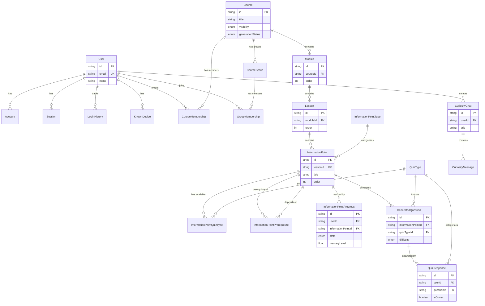

# Database Schema

**The authoritative reference for Cognia's data models.**

---

## Overview

This documentation defines the complete database schema for Cognia's learning platform. It serves as the single source of truth for all data models, organized by domain.

**Prisma Schema Location:** [`prisma/schema.prisma`](/prisma/schema.prisma)

---

## Schema Domains

The database is organized into five logical domains:

| Domain | Description | Link |
|--------|-------------|------|
| **Course Structure** | Content hierarchy and access control | [View](/docs/reference/database-schema/course-structure) |
| **Learning & Review** | Progress tracking and quiz system | [View](/docs/reference/database-schema/learning-review) |
| **Data Collection** | Analytics and behavior tracking | [View](/docs/reference/database-schema/data-collection) |
| **Curiosity Chat** | Free-form exploration conversations | [View](/docs/reference/database-schema/curiosity-chat) |
| **Auth & User** | Authentication and user management | [View](/docs/reference/database-schema/auth-user) |

---

## Master Entity Relationship Diagram

This diagram shows the relationships between all major tables across all domains.

---

## Table Summary

### Course Structure Domain

| Table | Purpose |
|-------|---------|
| `Course` | Top-level learning pathway container |
| `Module` | Thematic section within a course |
| `Lesson` | Study session containing information points |
| `InformationPoint` | Atomic unit of learning content |
| `CourseMembership` | Links users to courses with roles |
| `CourseGroup` | Cohorts/groups within a course |
| `GroupMembership` | Links users to groups |
| `InformationPointType` | Categorizes IPs by pedagogical purpose |
| `QuizType` | Defines quiz formats and mastery impact |
| `InformationPointQuizType` | Links IPs to available quiz types |
| `InformationPointPrerequisite` | Defines IP dependency relationships |

### Learning & Review Domain

| Table | Purpose |
|-------|---------|
| `InformationPointProgress` | Tracks user mastery per information point |
| `GeneratedQuestion` | AI-generated quiz questions |
| `QuizResponse` | Records user quiz answers |

### Data Collection Domain

| Table | Purpose | Status |
|-------|---------|--------|
| `StudySession` | Aggregates a study session | Phase 2 |
| `LearnModeEvent` | Tracks learning interactions | Phase 2 |
| `UserBehaviorProfile` | Aggregated user patterns | Phase 2 |
| `InformationPointAnalytics` | Content performance metrics | Phase 2 |
| `Experiment` | A/B testing configuration | Phase 2 |

### Curiosity Chat Domain

| Table | Purpose |
|-------|---------|
| `CuriosityChat` | Free-form exploration conversation |
| `CuriosityMessage` | Individual message in a curiosity chat |

### Auth & User Domain

| Table | Purpose |
|-------|---------|
| `User` | Core user identity |
| `Account` | OAuth provider connections |
| `Session` | Active user sessions |
| `VerificationToken` | Email verification tokens |
| `PasswordResetToken` | Password reset tokens |
| `LoginHistory` | Login audit trail |
| `KnownDevice` | Recognized user devices |

---

## How to Read Schema Pages

Each domain page includes:

- **ERD Diagrams** — Visual relationships between tables
- **Table Definitions** — Prisma model with all fields
- **Field Tables** — Description of each field
- **Seed Data** — Default values for lookup tables (where applicable)

---

## Quick Links

- [Course Structure](/docs/reference/database-schema/course-structure) — Content hierarchy, memberships, groups
- [Learning & Review](/docs/reference/database-schema/learning-review) — Progress tracking, questions, responses
- [Data Collection](/docs/reference/database-schema/data-collection) — Analytics models (Phase 2)
- [Curiosity Chat](/docs/reference/database-schema/curiosity-chat) — Chat models
- [Auth & User](/docs/reference/database-schema/auth-user) — Authentication tables

---

*For conceptual understanding of these models, see [Core Concepts](/docs/concepts).*
